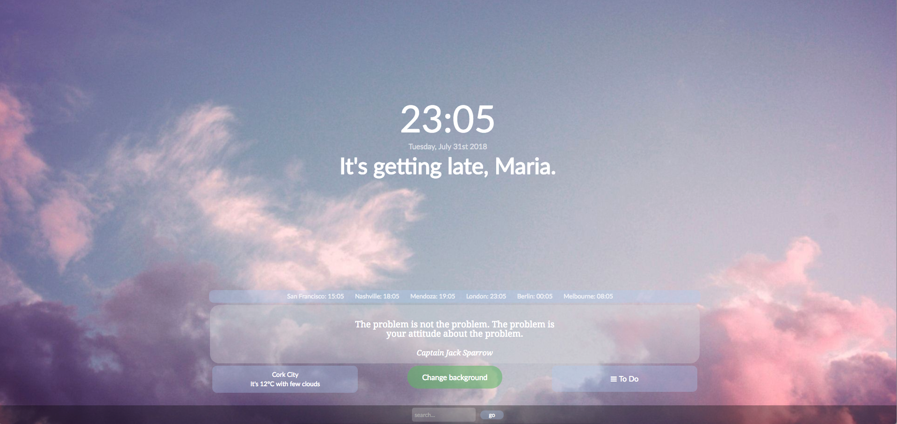

# HomeTab
After using the (free) Momentum browser home page for a while, I wanted to create my own to be able to personalise it more. 
This is an ongoing project, also used to try out new techniques from coding courses.  
I am currently running the page locally as the default browser home page / new tab page. 
 

#### Install

To customise, the page needs your name, your location (for weather) and an <a href="https://openweathermap.org/appid#get">API key from openweathermap</a> (free option available). No affiliation, I just liked their weather data output the best.

When `index.html` is loaded and no configuration information is found, `setup.html` is loaded. You can enter name, location and API key here. The values are stored in local storage. To test, you do not need to enter an API key, a default test key will be loaded.

If you want to download HomeTab to use as a homepage, make sure to get your own API key at https://openweathermap.org/appid#get, the default test key is a free key and will be temporarily blocked after a certain amount of calls.

Other customisation options not included in setup are described below.

Once the page is customised to you, you can set it as the default home page / new tab page of your browser. No need to upload to a webspace, it can just run locally.

To update info, visit `setup.html` by using the settings icon in the bottom left corner. 

#### Techniques used:
HTML, CSS, JavaScript

#### Tested in:

- Chrome
- Firefox
- Safari

#### Features:

- Random screen filling background image

- Clock: shows current time in hours and minutes, updated every 0.5s
- Date: shows current date as 'weekday, month, date, year', updated every 0.5s
- User greeting: shows a custom greeting depending on the current time, updated every 1s
    - change the greetings and timeframes in index.js , `greet_user(user_name)` function

- Timezone Clocks: show current time in different locations around the world, updated every 0.5s
    - modify `get_times()` and `worldclock()` function in index.js to edit which cities / timezones to show

- Quote: Shows a random quote whenever the page is loaded / reloaded 
    - currently using `_.sample` so picks can repeat, no other fine-tuning
    - the quote box will show an expanding animation everytime the page is loaded / reloaded
    - get a new random quote by clicking on the quote
    - quotes are set in index.js, `get_quote()` function
    

- Weather: Shows the current temperature and condition using openweathermaps API, updates every 15min
    - You can set the location and API key for the call through setup.html / config.json
    - To customise update time modifiy the timeout in the `get_weather_open(location,openweatherAPI)` function (be careful since there is a daily/monthly limit for free API calls using openweathermaps )

- Change Background button: Change the background image to another random pick 
    - currently using `_.sample` so picks can repeat, no other fine-tuning

- To Do List: Add to do items, cross them off and/or delete them. More work required here. The To Do List widget will currently not save to do items once the page is reloaded - the best kind of to do list is the self-erasing kind. 

- Search: bottom search bar searches Google for keyword in new tab

#### Notes:

index.js is referencing `images/bg001.jpg` - `images/bg011.jpg` 
Example images are included in the repository, but you can replace them with your own in the images folder 
Images are set in `random_bg()` function 

Example image sources: 
Free to use

https://www.pexels.com/photo/adventure-alps-background-beautiful-547114/

https://www.pexels.com/photo/blue-and-purple-cosmic-sky-956999/

https://images.pexels.com/photos/808465/pexels-photo-808465.jpeg?cs=srgb&dl=background-boardwalk-clouds-808465.jpg&fm=jpg

https://www.pexels.com/photo/background-balance-beach-boulder-289586/

https://www.pexels.com/photo/abendstimmung-atmospheric-background-beautiful-531872/

https://www.pexels.com/photo/yellow-bokeh-photo-949587/

https://www.pexels.com/photo/astronomy-background-constellation-cosmic-355887/

https://www.pexels.com/photo/abstract-background-beach-color-355288/

https://www.pexels.com/photo/scenic-view-of-the-mountain-733031/

https://www.pexels.com/photo/adventure-alpine-background-black-and-white-355770/

https://www.pexels.com/photo/black-and-white-gray-long-road-3131/

https://www.pexels.com/photo/classic-blue-coupe-die-cast-model-1037995/

https://www.pexels.com/photo/body-of-water-with-mountains-on-side-937782/

https://www.pexels.com/photo/layout-of-green-leaves-1227648/

https://www.pexels.com/photo/snow-top-mountain-under-clear-sky-1054218/

